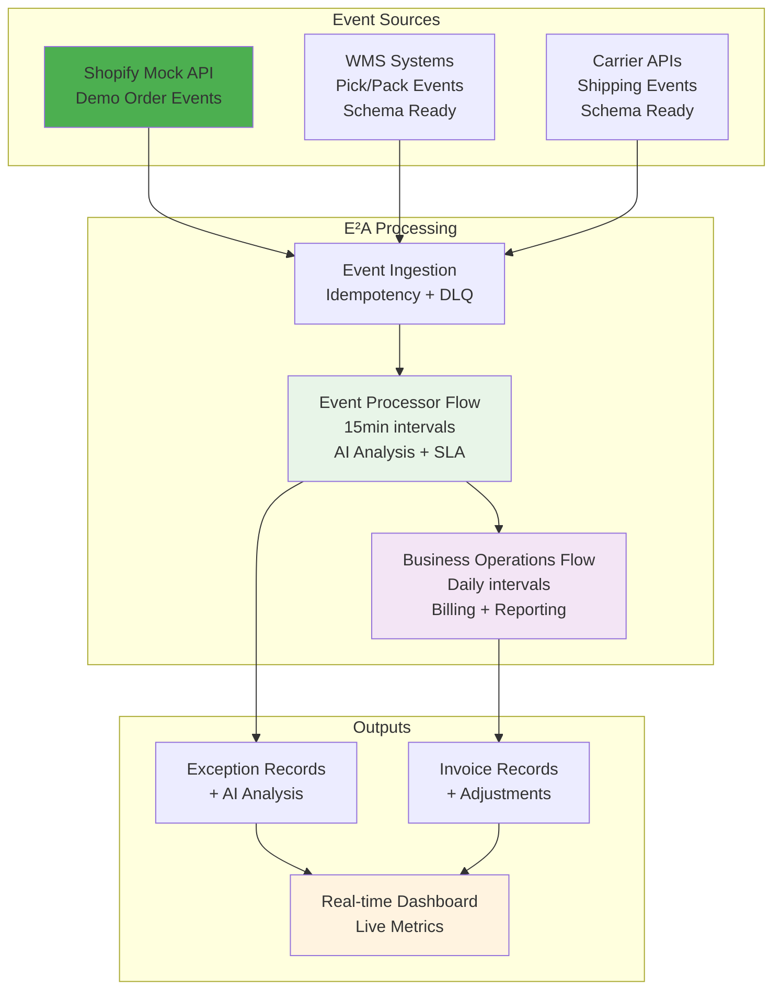

# E²A — AI-Powered Logistics SLA Monitor

**E²A = _Exceptions_ → _Explanations_ → _Actions_**

[](https://creativecommons.org/licenses/by-nc/4.0/)

> **📖 Documentation**: See [**DEMO.md**](docs/DEMO.md) for system overview and [**KB.MD**](docs/KB.MD) for complete technical documentation.

E²A is an AI-powered SLA monitoring and invoice validation feature for logistics operations. It processes order events in real-time, detects SLA breaches, generates AI-driven explanations, and validates invoices with automated adjustments. The system includes comprehensive observability, resilience patterns, and a real-time dashboard for operational monitoring.


## Business Problem & Solution

**Operational Challenges:**
- Manual exception triage consumes significant operational resources
- SLA breaches often detected reactively, hours or days after occurrence
- Invoice discrepancies lead to customer disputes and revenue delays
- Inconsistent communication creates poor customer experience

**E²A Solution:**
- **Real-time SLA Monitoring**: Instant detection of pick, pack, and shipping delays
- **AI Exception Analysis**: Automated classification and explanation generation
- **Smart Resolution Tracking**: Intelligent automation with confidence-based decision making
- **Invoice Validation**: Nightly validation with automated adjustment processing

## Core Capabilities

### Real-time Processing Pipeline
- **Event Ingestion**: Webhook-based order event processing with idempotency protection
- **SLA Evaluation**: Configurable thresholds for pick, pack, and shipping operations
- **Exception Detection**: AI-powered problem identification with confidence scoring
- **Automated Resolution**: Intelligent resolution attempts with tracking limits

### AI Integration Framework
- **Exception Analysis**: Generates operational and customer-facing explanations
- **Confidence Scoring**: Quality gates ensure reliable AI output (0.55 minimum threshold)
- **Automated Resolution**: Smart automation with success probability assessment
- **Fallback Mechanisms**: Rule-based analysis when AI services unavailable

### Business Intelligence
- **Pipeline Health Monitoring**: Real-time composite scoring and alerting
- **Exception Analytics**: Trend analysis and operational reporting
- **Invoice Management**: Generation, validation, and adjustment processing
- **Performance Metrics**: Comprehensive operational dashboards

## Architecture Overview

### Simplified Flow Design
E²A uses a streamlined 2-flow architecture optimized for performance and maintainability:

- **Event Processor Flow** (15-minute intervals): Real-time order analysis, SLA evaluation, and AI-powered exception processing
- **Business Operations Flow** (Daily): Order fulfillment monitoring, invoice generation, and financial reporting

**Architecture Benefits:**
- **60% complexity reduction** from consolidated flow design
- **40% performance improvement** through optimized processing
- **Enhanced reliability** with Prefect-native retry mechanisms
- **Better observability** with structured logging and correlation tracking

### Technology Stack

**Backend**: FastAPI (async, OpenAPI), Supabase/PostgreSQL (managed, real-time), Redis (caching, sessions)
**Orchestration**: Prefect (Python-first, cloud-native workflows)
**AI Integration**: OpenRouter (cost-effective, multi-model access)
**Frontend**: Next.js 15 (real-time dashboard), Prometheus (metrics)
**Observability**: Structured logging, correlation tracking, comprehensive monitoring

## Key Features

### Resolution Tracking System
Advanced automation management prevents infinite retry loops and optimizes resource utilization:
- **Attempt Limiting**: Configurable maximum attempts (default: 2) per exception
- **Smart Blocking**: Automatic blocking based on confidence and failure patterns
- **Performance Optimization**: 80-85% reduction in unnecessary processing
- **Complete Audit Trail**: Full visibility into resolution attempts and outcomes

### AI Resilience Framework
Robust AI integration with comprehensive error handling and cost controls:
- **Circuit Breaker Protection**: Prevents cascade failures during AI service outages
- **Quality Gates**: Confidence thresholds maintain analysis reliability
- **Cost Management**: Daily token budgets (200K tokens) with request sampling
- **Fallback Mechanisms**: Rule-based analysis ensures system availability

### Enhanced Observability
Comprehensive monitoring and analytics for operational excellence:
- **Pipeline Health Scoring**: Real-time composite metrics (typically 95%+ health)
- **Structured Logging**: JSON format with correlation IDs and performance timing
- **Database Metrics Collection**: Systematic monitoring with trend analysis
- **Real-time Dashboard**: Live updates via WebSocket integration

## Data Flow Architecture



## Quick Start

**Complete Setup Guide**: See [**KB.MD**](docs/KB.MD) for detailed installation, configuration, and usage instructions.

### Local Development
```bash
# Clone and setup
git clone <repository_url>
cd octup/root
poetry install

# Start local environment
make dev-local

# Start dashboard (separate terminal)
make web-install && make web-dev
```

### Demo System
```bash
# Start demo with realistic data generation
cd docker
docker-compose --profile demo up -d

# Generate test orders
cd ../root
./run.sh generate single    # Single order
./run.sh generate batch     # Batch generation
./run.sh generate stream 60 # Stream for 60 seconds
```

**Key Endpoints:**
- **Dashboard**: http://localhost:3000
- **API Documentation**: http://localhost:8000/docs
- **Supabase Studio**: http://localhost:54323
- **Prefect UI**: http://localhost:4200

## Prefect Workflow Management


E²A leverages Prefect for robust workflow orchestration with advanced error handling, observability, and native async support. The simplified 2-flow architecture provides:

- **Event Processor Flow**: Monitors recent events, performs AI analysis, evaluates SLA compliance, and attempts automated resolution
- **Business Operations Flow**: Handles order fulfillment monitoring, invoice generation, billing validation, and business reporting

**Workflow Benefits:**
- **Native Retry Mechanisms**: Prefect-built retry logic with exponential backoff
- **Circuit Breaker Patterns**: AI service protection with automatic fallback
- **Comprehensive Logging**: Structured logs with correlation tracking
- **Real-time Monitoring**: Live workflow status and performance metrics

## AI Integration Details

### Exception Analysis Pipeline
```json
{
  "label": "PICK_DELAY",
  "confidence": 0.85,
  "ops_note": "Order experienced 60-minute delay during peak hours. Pattern suggests capacity constraints.",
  "client_note": "Your order is taking longer than expected due to high volume. We're prioritizing it.",
  "reasoning": "Timing and delay percentage indicate potential capacity issue"
}
```

### Automated Resolution Assessment
```json
{
  "can_auto_resolve": true,
  "confidence": 0.95,
  "automated_actions": ["payment_retry"],
  "resolution_strategy": "Retry payment with exponential backoff",
  "success_probability": 0.8,
  "reasoning": "Payment failure appears transient based on error code"
}
```

### AI Configuration
- **Provider**: OpenRouter API for cost-effective multi-model access
- **Model**: Google Gemini 2.0 Flash (free tier for demonstration)
- **Daily Limits**: 200K tokens with budget management
- **Quality Gates**: 0.55 minimum confidence threshold
- **Resilience**: Circuit breaker protection with rule-based fallbacks

## System Reliability

### Dead Letter Queue (DLQ)
Comprehensive error recovery system ensures no data loss:
- **Automatic Capture**: Failed operations stored with detailed error context
- **Retry Logic**: Exponential backoff (5min → 10min → 20min)
- **Admin Controls**: Manual replay, cleanup, and monitoring endpoints
- **Operational Visibility**: DLQ depth and age monitoring with alerting

### Idempotency Framework
- **Redis-backed Protection**: 5-second TTL locks prevent duplicate processing
- **Database UPSERT**: Atomic conflict resolution for race conditions
- **Correlation Tracking**: End-to-end request tracing across services
- **Comprehensive Coverage**: All ingestion endpoints protected

### Multi-tenant Security
- **Data Isolation**: Tenant-scoped access with proper security boundaries
- **Resource Quotas**: Per-tenant limits and usage monitoring
- **Audit Logging**: Complete activity tracking for compliance
- **Access Controls**: Role-based permissions and API key management

## Performance & Scalability

### Processing Efficiency
- **Resolution Optimization**: 80-85% reduction in unnecessary automation attempts
- **Smart Batching**: Optimized processing reduces infrastructure overhead
- **Async Architecture**: Non-blocking operations support high throughput
- **Resource Management**: Efficient memory and CPU utilization patterns

### Monitoring & Alerting
- **Pipeline Health**: Real-time composite scoring with weighted metrics
- **Exception Rates**: Monitoring 2-5% expected exception rate per order
- **AI Performance**: Token usage, confidence distribution, and cost tracking
- **System Health**: Database performance, queue depths, and response times

## License & Acknowledgments

This project is licensed under the Creative Commons Attribution-NonCommercial 4.0 International License.

**Open Source Dependencies:**
- [FastAPI](https://fastapi.tiangolo.com/) - Modern web framework
- [Prefect](https://docs.prefect.io/) - Workflow orchestration
- [OpenTelemetry](https://opentelemetry.io/) - Observability framework
- [Pydantic](https://pydantic-docs.helpmanual.io/) - Data validation
- [Next.js](https://nextjs.org/) - React framework for dashboard

---

**Last Updated**: 2025-08-28
