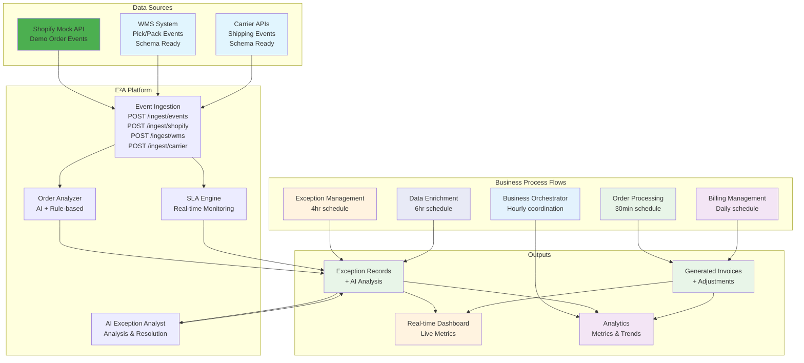
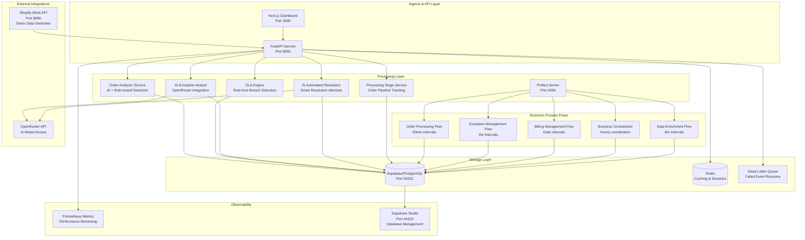
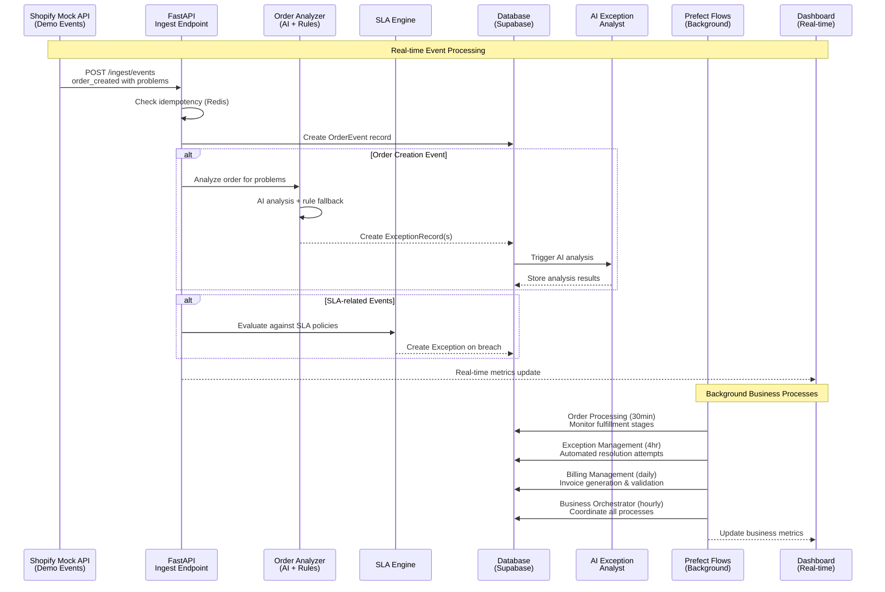
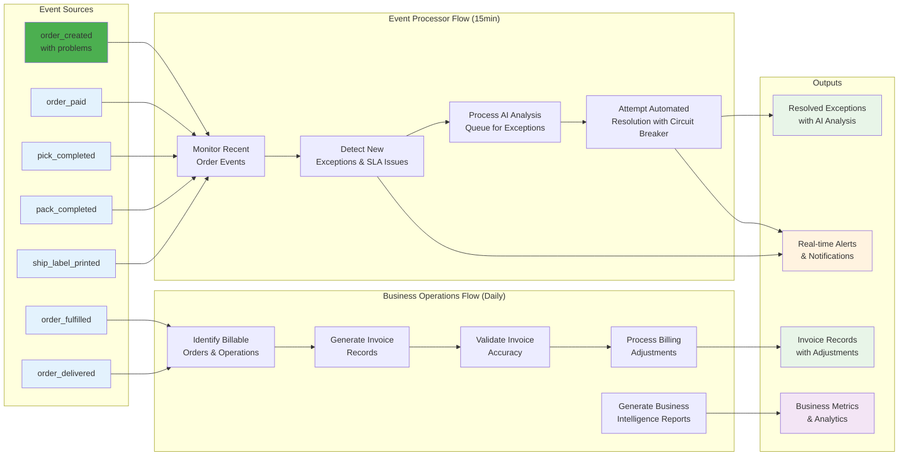

# E²A — SLA Radar + Invoice Guard

**E²A = _Exceptions_ → _Explanations_ → _Actions_**

[](https://creativecommons.org/licenses/by-nc/4.0/)

> **🚧 Demo Implementation Notice**
> 
> This is a **demonstration project** showcasing architecture and patterns for a 3PL exception management system. Several core business logic functions are simplified for demo purposes including billing calculations, SLA detection, and AI PII handling.
> 
> **📖 Documentation**: See [**DEMO.md**](docs/DEMO.md) for demo limitations and [**KB.MD**](docs/KB.MD) for complete technical documentation.

E²A is an AI-powered SLA monitoring and invoice validation tool for logistics. It watches order events, catches SLA breaches in real-time, generates AI explanations, and validates invoices nightly with auto-adjustments.
Includes foundation for Slack integration and realistic Shopify Mock API for demonstration.


## What Problem Does This Solve?

**For Warehouse Operations:**
- **Manual Exception Triage**: Teams spend significant time investigating SLA breaches
- **Reactive Problem Detection**: Issues often found hours/days later
- **Invoice Disputes**: Billing discrepancies can lead to customer disputes
- **Inconsistent Communication**: Customer notifications may vary in quality

**For Customers:**
- **Lack of Visibility**: Limited insight into order delays
- **Poor Communication**: Generic status updates
- **Billing Surprises**: Unexpected charges without justification

## Business Value

- **Designed to reduce** manual exception triage time
- **Real-time Detection** of SLA breaches for faster resolution
- **Automated invoice validation** to reduce billing disputes
- **Improved Customer Experience** with AI-generated explanations

## Core Features

- **Real-time SLA Monitoring**: Detect pick, pack, and shipping delays instantly
- **AI Exception Analyst**: Generate operational and customer-facing narratives using OpenRouter API
- **AI Automated Resolution**: Intelligent automation of common exceptions (payment retries, address validation, inventory reallocation) with confidence-based decision making
- **Invoice Guard**: Nightly invoice validation with auto-adjustments
- **AI Rule-Lint**: Validate business policies and generate test cases with AI assistance
- **Slack Integration Foundation**: Basic Slack bot framework with webhook handling and query processing
- **RAG Service Foundation**: Placeholder RAG service ready for vector database integration (compatible with [Meulex](https://github.com/chernistry/meulex/) RAG stack)
- **Resilience**: Circuit breakers, Dead Letter Queue (DLQ), retry policies, replay, health monitoring
- **Real-Time Dashboard**: Next.js 15 dashboard with live metrics, monitoring, AI insights
- **Shopify Mock API Demo**: Realistic e-commerce data generation with automatic webhook integration and exception simulation

## Dead Letter Queue (DLQ) System

E²A includes a robust Dead Letter Queue system that acts as a safety net for failed operations. When event processing fails (due to network issues, database errors, or other transient failures), items are automatically captured in the DLQ with detailed error context. The system implements exponential backoff retry logic (5 min → 10 min → 20 min) and provides admin endpoints for manual replay, cleanup, and monitoring. This ensures no events are lost and provides operational visibility into system failures, making E²A highly resilient to transient issues.

## AI Integration

E²A integrates AI to assist with exception analysis, automated resolution, and policy validation, designed to reduce manual triage time and automate common operational tasks.

### AI Exception Analyst
Analyzes logistics exceptions and generates:
- **Operational Notes**: Analysis for ops teams based on available data
- **Customer Notes**: User-friendly explanations without internal jargon
- **Classification Labels**: Structured categorization (PICK_DELAY, PACK_DELAY, CARRIER_ISSUE, etc.)
- **Confidence Scores**: AI confidence levels for quality control

**Example Analysis:**
```json
{
  "label": "PICK_DELAY",
  "confidence": 0.85,
  "ops_note": "Order experienced a 60-minute delay during peak hours. Pattern suggests potential capacity constraints during afternoon rush.",
  "client_note": "Your order is taking longer than expected due to high volume. We're prioritizing it and will update you shortly.",
  "reasoning": "Timing and delay percentage indicate potential capacity issue"
}
```

### AI Automated Resolution 
Intelligently analyzes raw order data to determine if exceptions can be automatically resolved without human intervention.
**Supported Automation Actions:** Includes stubs for payment retry with exponential backoff, address validation and postal code correction, inventory reallocation between warehouses, automated system health checks and recovery, and carrier API status synchronization.

**Example Automated Resolution:**
```json
{
  "can_auto_resolve": true,
  "confidence": 0.95,
  "automated_actions": ["payment_retry"],
  "resolution_strategy": "Retry payment with exponential backoff",
  "success_probability": 0.8,
  "reasoning": "Payment failure appears transient based on error code and timing"
}
```

### AI Policy Linting
Reviews business policies (SLA configurations, billing rules) and provides:
- **Validation Issues**: Syntax errors, missing fields, invalid values
- **Best Practice Suggestions**: Optimization recommendations and edge case handling
- **Test Case Generation**: Suggested test scenarios for policy validation
- **Risk Assessment**: Identifies potential operational considerations

**Supported Policy Types:**
- SLA policies (pick/pack/ship timeframes)
- Billing configurations (late fees, adjustments)
- Threshold settings (warning/critical levels)

### AI Configuration
```yaml
# Production settings via OpenRouter
AI_PROVIDER_BASE_URL: https://openrouter.ai/api/v1
AI_MODEL: google/gemini-2.0-flash-exp:free
AI_MAX_DAILY_TOKENS: 200000
AI_MIN_CONFIDENCE: 0.55
AI_TIMEOUT_SECONDS: 3
AI_RETRY_MAX_ATTEMPTS: 2
AI_SAMPLING_SEVERITY: important_only
```

### AI Resilience Features
- **Circuit Breaker Protection**: Prevents cascade failures during AI service outages
- **Fallback Mechanisms**: Rule-based analysis when AI is unavailable (confidence < 0.55)
- **Token Budget Management**: Daily limits (200K tokens) to control costs
- **Confidence Thresholds**: Quality gates for AI-generated content
- **Comprehensive Monitoring**: Prometheus metrics for AI requests, tokens, costs, failures


### AI Implementation Details
**Prompts**: External Jinja2 templates in `/prompts/` directory for maintainability
**JSON Extraction**: Robust parsing with fallback mechanisms for malformed AI responses  
**Error Handling**: Graceful degradation with rule-based fallbacks
**Cost Control**: Daily token budgets and request sampling based on severity 
**RAG Integration**: Foundation compatible with vector databases (Qdrant, Pinecone) and RAG frameworks like [Meulex](https://github.com/chernistry/meulex/) for enhanced Slack bot capabilities 


## Architecture

**🚧 Current Implementation Status**: 
- ✅ **Shopify Mock API**: Fully functional with realistic order generation and webhook integration
- ✅ **Order Analysis**: AI-powered problem detection with rule-based fallback working end-to-end
- ✅ **Exception Management**: Complete pipeline from detection to AI analysis and resolution tracking
- 🔄 **WMS/Carrier Integration**: Schemas and endpoints ready, awaiting real system integration
- ✅ **Prefect Orchestration**: All business flows deployed and running on scheduled intervals
- ✅ **Real-time Dashboard**: Live metrics and monitoring with WebSocket updates

### High-Level Data Flow



### System Components



### Data Flow



### Business Process Pipeline



### Technology Stack

**FastAPI** (async, OpenAPI docs), **Supabase/PostgreSQL** (managed, auth, real-time, looks cool), **Redis** (persistence, atomic ops), **Prefect** (Python-first, cloud-native, also looks cool), **OpenRouter** (cost-effective, multi-model), **Next.js + Prometheus** (real-time dashboard, metrics).

### Design Patterns & Principles

**🔧 Key Architectural Decisions:**

1. **Idempotency Strategy**: Redis-backed duplicate protection with 5-second locks and UPSERT fallback
2. **AI Fallback Strategy**: Hybrid AI + rule-based system with 0.55 confidence threshold and $20/day budget  
3. **Event Sourcing**: Event-driven SLA evaluation with configurable policies and real-time breach detection

**Benefits**: Fast duplicate detection, AI-assisted analysis, real-time SLA monitoring.

## Quick Start

**📖 Complete Setup Guide**: See [**KB.MD**](docs/KB.MD) for detailed setup, configuration, deployment, usage, testing, and demo system instructions.

**Key Endpoints:**
- **Dashboard**: http://localhost:3000
- **API**: http://localhost:8000 | **API Docs**: http://localhost:8000/docs
- **Supabase Studio**: http://localhost:54323 | **Prefect UI**: http://localhost:4200
- **Shopify Mock API**: http://localhost:8090 | **Mock API Docs**: http://localhost:8090/docs

**🔧 Advanced Topics**: See [**KB.MD**](docs/KB.MD) for troubleshooting, performance tuning, monitoring, and production deployment.

## Prefect Workflows


*Prefect UI showing completed business process workflows with task flow, logs, and execution details.*

**Why Prefect?**: Python-first, advanced error handling with retries/circuit breakers, observability, easy local dev w/ Community Server, native async.

E²A uses consolidated business process flows managed by the Business Operations Orchestrator:

- **Order Processing Flow** (30min intervals): Monitors order fulfillment progress, manages optional processing stages, detects SLA breaches, and generates invoices for completed orders
- **Exception Management Flow** (4hr intervals): Analyzes exception patterns, prioritizes eligible exceptions by severity, attempts automated resolution with AI, and tracks resolution success rates  
- **Billing Management Flow** (Daily): Identifies billable operations, generates invoice records, validates accuracy with AI assistance, and processes billing adjustments
- **Business Operations Orchestrator** (Hourly): Coordinates all business processes, generates business intelligence reports, and monitors system health
- **Data Enrichment Flow** (6hr intervals): Enriches order data with additional context and performs data completeness validation

Prefect deployments run these flows on schedules or on-demand via UI, API, or CLI with comprehensive error handling and retry logic.

## License

This project is licensed under the Creative Commons Attribution-NonCommercial 4.0 International License.

## Acknowledgments

This project uses several open-source packages:
- [FastAPI](https://fastapi.tiangolo.com/) for the web framework
- [Prefect](https://docs.prefect.io/) for workflow orchestration
- [OpenTelemetry](https://opentelemetry.io/) for observability
- [Pydantic](https://pydantic-docs.helpmanual.io/) for data validation
- [Alembic](https://alembic.sqlalchemy.org/) for database migrations
- [next-shadcn-dashboard-starter](https://github.com/Kiranism/next-shadcn-dashboard-starter) for the Next.js dashboard template
- [Faker](https://faker.readthedocs.io/) for realistic test data generation

---

**Last Updated**: 2025-08-24  
