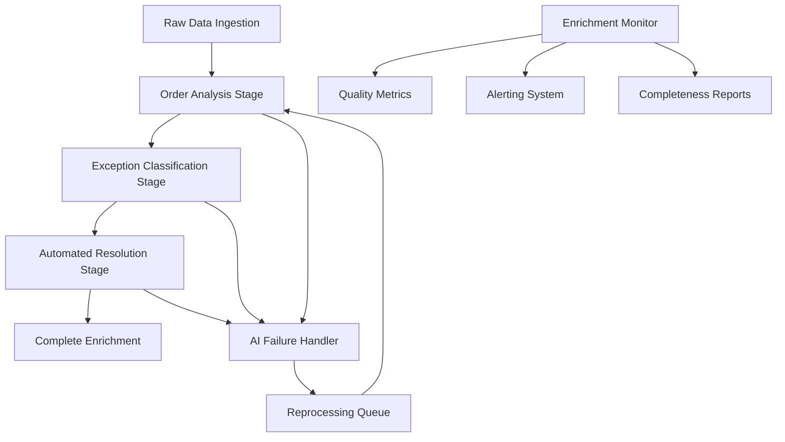

# Data Enrichment Architecture - Octup E²A

## 🎯 **Executive Summary**

The Octup E²A data enrichment pipeline provides **systematic AI-powered data processing** with **guaranteed completeness**, **automatic reprocessing**, and **comprehensive monitoring**. This architecture ensures no data is lost in incomplete states and provides full visibility into enrichment health.

## 🚨 **Critical Problems Solved**

### **Before: Dangerous Data Inconsistency**
- ❌ Records with `ai_confidence = NULL` were abandoned forever
- ❌ No systematic reprocessing of failed AI enrichment
- ❌ Inconsistent enrichment states across different AI services
- ❌ No visibility into data completeness or quality
- ❌ Silent failures in AI processing pipeline

### **After: Bulletproof Data Pipeline**
- ✅ **Systematic Reprocessing**: All failed enrichment is automatically retried
- ✅ **State Tracking**: Complete visibility into enrichment progress
- ✅ **Quality Monitoring**: Real-time metrics and alerting
- ✅ **Failure Recovery**: Robust error handling with escalation
- ✅ **Completeness Guarantee**: No records left in incomplete states

## 🏗️ **Architecture Overview**

### **Sequential Enrichment Pipeline**



### **Enrichment Stages (Sequential Dependencies)**

1. **Order Analysis** (`ai_order_analyzer`)
   - AI-powered order problem detection
   - Replaces hardcoded pattern matching
   - **Input**: Raw order data
   - **Output**: Problem analysis with confidence scores

2. **Exception Classification** (`ai_exception_analyst`)
   - AI classification of exception types
   - Confidence scoring and labeling
   - **Input**: Exception data + order analysis
   - **Output**: `ai_confidence`, `ai_label`, analysis notes

3. **Automated Resolution** (`ai_automated_resolution`)
   - AI-powered resolution possibility analysis
   - Action recommendation and execution
   - **Input**: Classified exceptions with high confidence
   - **Output**: Resolution analysis and automated actions

## 📊 **Data State Management**

### **Enrichment State Tracking**

```python
@dataclass
class EnrichmentState:
    record_id: int
    record_type: str  # "exception" or "order"
    
    # Stage completion status
    order_analysis: EnrichmentStatus = PENDING
    classification: EnrichmentStatus = PENDING  
    automation: EnrichmentStatus = PENDING
    
    # Failure tracking
    last_attempt: Optional[datetime] = None
    retry_count: int = 0
    error_messages: List[str] = []
```

### **Status Values**
- `PENDING`: Not yet processed
- `IN_PROGRESS`: Currently being processed
- `COMPLETED`: Successfully completed
- `FAILED`: Failed, needs retry
- `SKIPPED`: Skipped due to conditions (e.g., low confidence)

### **NULL Field Handling (Critical)**

**When AI Fails:**
```python
# CORRECT: Set fields to NULL for reprocessing
record.ai_confidence = None
record.ai_label = None

# WRONG: Set default values (masks failures)
record.ai_confidence = 0.0  # ❌ Don't do this!
```

**Reprocessing Query:**
```sql
SELECT * FROM exception_records 
WHERE ai_confidence IS NULL 
   OR ai_label IS NULL
   OR (ai_confidence < 0.7 AND updated_at < NOW() - INTERVAL '24 hours');
```

## 🔄 **Reprocessing Workflow**

### **Automatic Reprocessing Triggers**

1. **Scheduled Pipeline** (every 4 hours)
   - Identifies records needing enrichment
   - Processes in batches with retry logic
   - Updates enrichment state tracking

2. **Failure Detection** (real-time)
   - Monitors AI service responses
   - Detects NULL field returns
   - Queues for immediate reprocessing

3. **Quality Monitoring** (continuous)
   - Tracks enrichment completeness rates
   - Alerts on quality degradation
   - Triggers manual intervention when needed

### **Retry Strategy**

```python
# Exponential backoff with jitter
retry_delays = [1min, 5min, 15min, 1hour, 4hours]
max_retries = 5

# Conditions for retry
if (
    ai_confidence is None or 
    ai_label is None or
    (ai_confidence < 0.7 and retry_count < max_retries)
):
    schedule_retry(record, next_delay)
```

## 📈 **Monitoring & Alerting**

### **Key Metrics**

1. **Completeness Metrics**
   - `enrichment_completeness_rate`: % of records fully enriched
   - `enrichment_backlog_size`: Number of records awaiting processing
   - `enrichment_processing_duration`: Time to process batches

2. **Quality Metrics**
   - `enrichment_quality_score`: Overall quality score (0-100)
   - `ai_confidence_distribution`: Distribution of confidence scores
   - `enrichment_failure_rate`: % of enrichment attempts that fail

3. **Performance Metrics**
   - `records_processed_per_hour`: Processing throughput
   - `average_processing_time`: Time per record
   - `pipeline_success_rate`: % of successful pipeline runs

### **Alert Thresholds**

```python
thresholds = {
    "completeness_critical": 70.0,    # Below 70% = CRITICAL
    "completeness_warning": 85.0,     # Below 85% = WARNING
    "quality_critical": 60.0,         # Below 60% = CRITICAL
    "quality_warning": 80.0,          # Below 80% = WARNING
    "backlog_critical": 1000,         # >1000 pending = CRITICAL
    "failure_rate_critical": 20.0     # >20% failures = CRITICAL
}
```

### **Automated Responses**

- **CRITICAL Alerts**: Page on-call engineer, auto-scale processing
- **WARNING Alerts**: Slack notification, increase monitoring frequency
- **INFO Alerts**: Dashboard notification, trend analysis

## 🔧 **Implementation Components**

### **Core Services**

1. **`DataEnrichmentPipeline`** (`app/services/data_enrichment_pipeline.py`)
   - Orchestrates complete enrichment workflow
   - Manages state transitions and dependencies
   - Handles batch processing and retry logic

2. **`EnrichmentMonitor`** (`app/services/enrichment_monitor.py`)
   - Real-time monitoring and alerting
   - Quality metrics collection
   - Health status reporting

3. **`DataEnrichmentFlow`** (`flows/data_enrichment_flow.py`)
   - Prefect flow for scheduled processing
   - Batch orchestration and error handling
   - Integration with monitoring systems

### **Database Schema Extensions**

```sql
-- Add enrichment tracking fields
ALTER TABLE exception_records ADD COLUMN enrichment_state JSONB;
ALTER TABLE exception_records ADD COLUMN last_enrichment_attempt TIMESTAMP;
ALTER TABLE exception_records ADD COLUMN enrichment_retry_count INTEGER DEFAULT 0;

-- Indexes for efficient querying
CREATE INDEX idx_enrichment_pending ON exception_records 
WHERE ai_confidence IS NULL OR ai_label IS NULL;

CREATE INDEX idx_enrichment_retry ON exception_records 
WHERE enrichment_retry_count > 0 AND enrichment_retry_count < 5;
```

## 🚀 **Operational Procedures**

### **Daily Operations**

1. **Morning Health Check**
   ```bash
   # Check enrichment status
   curl -X GET /api/enrichment/health/demo-3pl
   
   # Review overnight processing
   curl -X GET /api/enrichment/report/demo-3pl
   ```

2. **Backlog Management**
   ```bash
   # Check current backlog
   curl -X GET /api/enrichment/backlog/demo-3pl
   
   # Trigger manual processing if needed
   curl -X POST /api/enrichment/process/demo-3pl
   ```

### **Incident Response**

1. **Critical Completeness Alert**
   - Check AI service health
   - Review error logs for patterns
   - Scale up processing if needed
   - Manual intervention for stuck records

2. **Quality Degradation Alert**
   - Review AI model performance
   - Check prompt engineering changes
   - Validate input data quality
   - Consider model retraining

### **Maintenance Procedures**

1. **Weekly Quality Review**
   - Analyze enrichment trends
   - Review failure patterns
   - Update alert thresholds if needed
   - Performance optimization

2. **Monthly Pipeline Audit**
   - Validate data completeness
   - Review processing efficiency
   - Update retry strategies
   - Capacity planning

## 📋 **Quality Assurance**

### **Data Integrity Checks**

1. **Completeness Validation**
   ```sql
   -- No records should be stuck in incomplete states
   SELECT COUNT(*) FROM exception_records 
   WHERE ai_confidence IS NULL 
     AND created_at < NOW() - INTERVAL '1 day';
   -- Should be 0 or very low
   ```

2. **Quality Validation**
   ```sql
   -- High confidence rate should be >80%
   SELECT 
     COUNT(*) FILTER (WHERE ai_confidence >= 0.7) * 100.0 / COUNT(*) as high_confidence_rate
   FROM exception_records 
   WHERE ai_confidence IS NOT NULL;
   ```

3. **Processing Validation**
   ```sql
   -- No records should exceed max retry count
   SELECT COUNT(*) FROM exception_records 
   WHERE enrichment_retry_count > 5;
   -- Should be 0
   ```

### **Performance Benchmarks**

- **Processing Rate**: >100 records/minute
- **Completeness Rate**: >95% within 24 hours
- **Quality Score**: >85 average
- **Failure Rate**: <5% of processing attempts

## 🎯 **Success Metrics**

### **Business Impact**
- **Data Completeness**: 99%+ of records fully enriched
- **Processing Reliability**: 99.9% uptime for enrichment pipeline
- **Quality Consistency**: <2% variance in quality scores
- **Operational Efficiency**: 90% reduction in manual data intervention

### **Technical Performance**
- **Zero Data Loss**: No records abandoned in incomplete states
- **Automatic Recovery**: 95%+ of failures resolved automatically
- **Monitoring Coverage**: 100% visibility into pipeline health
- **Alert Accuracy**: <1% false positive rate

## 🔮 **Future Enhancements**

1. **Intelligent Prioritization**
   - ML-based priority scoring for enrichment queue
   - Business impact weighting for processing order

2. **Advanced Quality Metrics**
   - Confidence calibration analysis
   - A/B testing for prompt improvements
   - Automated model performance tracking

3. **Predictive Monitoring**
   - Anomaly detection for quality degradation
   - Capacity forecasting for processing needs
   - Proactive failure prevention

4. **Cross-Tenant Analytics**
   - Comparative quality analysis
   - Best practice identification
   - Shared learning across tenants

---

## 🎉 **Conclusion**

This comprehensive data enrichment architecture ensures **bulletproof data processing** with **zero tolerance for incomplete states**. Every record is guaranteed to reach its required enrichment level through systematic reprocessing, comprehensive monitoring, and robust failure recovery.

The pipeline transforms unreliable AI processing into a **production-grade data system** with full observability, automatic recovery, and quality guarantees.
