# High Level Platform Architecture

Based on the analysis of observed artifacts, the following platform architecture hypothesis was formed:

*   **Hosting and Perimeter**: The system is deployed in Google Cloud, utilizing an HTTPS Load Balancer (L7) to serve multiple SNI-hosts like `{tenant}.app.example.com`. Traffic is routed to backend services via Ingress.
*   **Orchestration**: Dev environments use Nginx and a “Kubernetes Ingress Controller Fake Certificate,” indicating the use of Kubernetes (GKE) with Nginx-ingress.
*   **Environments and Deployment**: The naming conventions of dev hosts (`dev.features-*`) suggest the use of ephemeral environments for features/PRs. Access to these is restricted (403 HTTP response), and a VPN is used for private network access.
*   **Multi-tenancy**: The platform is a multi-tenant SaaS, where tenant resolution occurs via the host header (`{tenant}.app.example.com`), and the frontend is implemented as an SPA.
*   **Microservice Decomposition**: The names of dev hosts (e.g., `billing-*`, `*-api`, `*-partner`) indicate clearly separated bounded contexts, such as billing, returns, and the partner segment.

The diagram below illustrates the hypothesized system architecture:

```mermaid
%%{init: {
  "theme": "base",
  "themeVariables": {
    "fontSize": "10px",
    "primaryColor": "#ffffff",
    "primaryBorderColor": "#666666",
    "lineColor": "#666666",
    "tertiaryColor": "#f5f5f5",
    "clusterBkg": "#fafafa",
    "clusterBorder": "#999999"
  },
  "flowchart": {
    "htmlLabels": false,
    "curve": "linear",
    "padding": 2,
    "nodeSpacing": 12,
    "rankSpacing": 20
  }
}}%%

flowchart TB

%% ---------------- ROW 0: Edge & Routing ----------------
subgraph ROW0[ ]
direction LR
  USERS["End Users"]:::ext -->|HTTPS| CDN["CDN/WAF"]
  PARTNERS["Partners"]:::ext -->|HTTPS| CDN
  ADMIN["Internal Staff"]:::ext -->|VPN/SSO| CDN
  CDN --> APIGW["API GW + Ingress (L7)"]
  APIGW --> TENANT["Tenant Resolver<br/>{tenant}.app.example.com<br/>+ policy"]
end

%% ---------------- ROW 1: Frontends + Identity ----------------
subgraph ROW1[ ]
direction LR
  subgraph FE["Frontends"]
    direction TB
    APP["Web App (SPA)<br/>customer tenants"]
    PARTNERP["Partner Portal (SPA)"]
    ADMINC["Admin Console (SPA)"]
  end
  subgraph IDP["Identity, Tenancy & Config"]
    direction TB
    AUTH["Auth/OIDC<br/>reset, tokens"]
    ORG["Tenant/Org<br/>plans, roles, quotas"]
    FLAGS["Feature Flags/Config"]
    RBAC["RBAC/ABAC Policies"]
  end
end

%% Frontend API calls
APP -->|API| APIGW
PARTNERP -->|API| APIGW
ADMINC -->|API| APIGW

%% Tenant services wiring
TENANT --> AUTH
TENANT --> ORG
TENANT --> FLAGS
TENANT --> RBAC

%% ---------------- ROW 2: Core Domain Services ----------------
subgraph ROW2[ ]
direction LR
  subgraph OMS["Orders & Operations"]
    direction TB
    ORD["Order Ingestion<br/>idempotency, retries"]
    INV["Inventory Service"]
    SHIP["Shipment/Label"]
    WF["Workflow Orchestrator "]
  end
  subgraph BILL["Billing & Monetization"]
    direction TB
    BILLP["Billing Profile"]
    BILLC["Billing Cycle / Period Close"]
    RETB["Returns Billing"]
    INVC["Invoice / Settlement"]
    PRICE["Pricing/Discounts "]
  end
  subgraph FIN["Finance Analytics (GPA)"]
    direction TB
    COST["Cost Allocation / CoGS "]
    REV["Revenue Attribution "]
    REP["Financial Reports & Dashboards"]
    DATAFIX["Data Correction Jobs<br/>schema &amp; value fixes"]
  end
  subgraph INTG["Integrations Hub"]
    direction TB
    WMS["WMS/3PL Connectors<br/>(Scend, Deliverzen)<br/>webhooks + polling"]
    ECOMM["E-commerce Connectors<br/>(Shopify/BigCommerce/…)"]
    PAY["Payment/AR "]
    CARR["Carrier/Tracking "]
    INGH["Integration Health/Retry<br/>rate limits, dedupe"]
  end
  subgraph OPS["Ops & Admin"]
    direction TB
    CFG["Settings/Params"]
    LOC["Locations/Working Hours"]
    CTBL["Custom Tables CRUD"]
  end
  subgraph AI["Assistant (LLM) "]
    direction TB
    ASK["AI Assistant<br/>prompt orchestration"]
    LLM["LLM Bridge (Vertex/OpenAI)<br/>per-tenant context"]
  end
end

%% API GW to domains
APIGW --> OMS
APIGW --> BILL
APIGW --> FIN
APIGW --> INTG
APIGW --> OPS
APIGW --> AI
APIGW --> IDP

%% ---------------- ROW 3: Data & Async Fabric ----------------
subgraph FABRIC["Data & Async Fabric"]
direction LR
  BUS[("Event Bus / PubSub<br/>outbox/inbox, DLQ")]
  QUE[("Task Queue / Workers")]
  CACHE[("Cache e.g., Redis")]
  ODB[("Operational DBs<br/>Postgres/MySQL (per-tenant or RLS)")]
  OBJ[("Object Storage e.g., GCS")]
end

%% Core -> Fabric (grouped to reduce clutter)
OMS --> QUE
OMS --> ODB
OMS --> CACHE
BILL --> QUE
BILL --> ODB
BILL --> CACHE
AI --> QUE
AI --> ODB
AI --> CACHE
FIN --> ODB
FIN --> OBJ
INTG --> ODB
INTG --> CACHE
INTG --> OBJ
OPS --> ODB

%% Events bus fan-out
INTG -->|normalized events| BUS
ORD --> BUS
BUS --> ORD & INV & SHIP & BILLC & INVC & COST & REP

%% ---------------- ROW 4: Analytics & Observability ----------------
subgraph DPLAT["Analytics & Observability"]
direction LR
  LAKE[("Data Lake<br/>e.g., GCS Parquet")]
  DWH[("DWH e.g., BigQuery")]
  ETL["ETL/ELT Pipelines<br/>stream + batch"]
  METRICS["Observability:<br/>Logs/Metrics/Traces"]
  ALERT["Alerting / SLO Budgets"]
end

ODB --> ETL
OBJ --> ETL
ETL --> LAKE --> DWH --> REP

%% Observability flows (dashed)
METRICS -. scrapes/ingest .-> OMS
METRICS -. scrapes/ingest .-> BILL
METRICS -. scrapes/ingest .-> FIN
METRICS -. scrapes/ingest .-> INTG
METRICS -. scrapes/ingest .-> AI
METRICS -. scrapes/ingest .-> IDP
ALERT -. SLOs/thresholds .-> METRICS

%% ---------------- ROW 5: Delivery Pipeline ----------------
subgraph CICD["Delivery & Environments "]
direction LR
  BUILD["CI (Actions/Cloud Build)"]
  REG["Image Registry"]
  GITOPS["GitOps/ArgoCD/K8s Deploy"]
  PREV["Ephemeral Envs (feature-*)"]
end

BUILD --> REG
REG --> GITOPS
GITOPS --> OMS & BILL & FIN & INTG & OPS & AI & IDP
PREV -. on PR/branch .-> APIGW

%% External actors style
classDef ext fill:#ffffff,stroke:#888,stroke-dasharray:3 2,color:#333
```

[[See Full Graph]](https://www.mermaidchart.com/play#pako:eNqFWO1y27oRfZUdZ-yxe2Uzie9tU7VzZyjqw0poiyHluJ3o_gBJSEJNAbwg5Fj5mOmvPkAfog92n6S7IEVSccLYM5RAnAWxuwdnl_p0lKiUH_WPjo_B_fl8qQWXabbrQ6I2OUsMFHgVctWDjZIqWWu14T1IMs40aPWhWMjj409CCtOHTwsJsDgya77hi6M-fo1Zgd96rfvvmBYsznhBAGtAU0slTSQ-VlYvnuePlRVN5lpsmN55KlO6BDxb2r-nmIHSKddt5J_tXwuZCck7AYZrI75-3i_03wIl2bZA4OB-tUcw-v8Gwu6oAv3V_i2OCPOlisoyUx-SNdPmICBrs8l8FvPMxmnJsoI3K2_1QxUpcobpdhxYmmKyaPZlfVNigqMyizTxopnRTN63Zl4-tztbyC9fjo8XciHrzcF8QGPkyPlXfxDO7uB5H0bpisMJhGprcLUnsIUstvFKs3xNBs_fw28LmQrNEyOUBD-kB99GozB6vzgayRRuC67R99_6_T5_NLjcr5-v5vMg-gze8AYxeHXu3DEiyDJww_lNaRzgbmWHLcHd4fWUFplKzJBkGUSGEZ3aFu-CGyeKZrUNftB9cIPp5A5t8RMmd_ATTOVK86KAU_8vZ9V2LMai56Mb92aO8DmXTBoIeaGyB67_Hmvn10_G3vxywfL8QiVmm1_gobNTP0GuMpHs7IJ4ILuC_6IPY40HCGEF7Sfl0giz-0EKXnwzBTViPMJN18tWfgE0eCIE3XGDAJF3PAY3z-E0Ctwz60GC9Eep0FA62SxR5SpocgWB0gazYI1rnE2SR5FON0KCpySGjh-AbGBam54OadV9AHpgg57skJZovRSrLjdu51f0rK1ZO3Pp0LM-YF656YFR91w2DszCSZ1QZ6ZXFppnTBY9VESUth78vlWGNRZj350QN8ecma3mMM7YqnC-2lM4cMlb-nBcvGBUkAGCF21nGyrsc0Nkg4RlqBQSc2G5i7c-lyRcyH24n0yU8X1y2y5esRXP4INIeAEfhCaJkCWdy3OAATu4gWE5GFunD-6Qa11EftnHPGF4hmrDMOPR_undRH7ZTeTZNUV-RipcIBFmOdeMcF2cnoXDvQ0db17QrE2zSPkmVxj3BOmludFNfgCmN--sqDwg_5Te7R2o56OrKfEzWot8gxDHCnw9ezemc6T0PYkuzHSyxufiXpWG79B9MPV9tBmILCPJPYFrJbkRH61_He6RXdAyDLRaiqzZJ817rXlvh-UeHAi4FioFL1NFAw5H8wHRliOzZQGVTTsmXhkUhaHARSJuTMbJ_0YRwqlHchNoQZXIGYoiUVvUjO85PrbqPRZ0ujm4qOA7IxKU4ElbQJ467s0i0mJPFQbcLFOJjRRuylOTCFouvbMeYR63uLzBLMdbi2xBgnoHAqUr5DlqGBFsyIp1rJhuiebQnbvj6T_QYMgMI47vN_ZaxYXlVYHZ3jA4YZv8b_DAMnzuUjwenv220N3MJ1X9WlV0hqtt3OH6nT0GeHUuA5_kUCJA6fLpp1GCT-jBkGcCi9NHLksN_8DjtVL3VFWwHB3kdeTNrq-pVp9jyUKZxzw8WXStcrHcOQOx8iqM88e__3fWqgT_tEVgZ0-DGzbh9dwwpEQxjQdMO3PNkntiYotWk6vDAMAVZxmKNxJR70r1ZoZDJjbCoCKnPN3m_DvhnAVWI3LKn602XRwaU-SJxbihwsESxjZNqv0Zsd2vmFU4dJ5p41dqqxuUNx_QwfVsiYS57YfBC2-H39mfO6XSVBSiMCTLp75_fQZdxSx6Q_5QRwG1WVmmsH3PDahaXdpKgcvS5v1rGGhB7dzpO-yF-aODoindackJ1M_zsqTjGwKG_9F8uz5V_ZFRkFo5t-Vp3xahKLeHJDjtMZ7v9pDYfmAdHFi70wPwMOiqMZd9sIcQE13sZAJjFqPqdJWYsTtAfdof3kM76_rXpWdwG70_xZNBZQAG24KUcxtH29jGD_vjWD06QuIVT5z_dnF0ZuP39nZEZnNW3MPbLd-SWBJ9bC9bQjzXu3Igj2H-gG-sLnooPamoEbPhgObrKofSNByU5zFA1aNO1bneRW99OG0lEktM6Edn9SKD13aR-F_oF_bGSrPV_mkTLyphTaZtzf7jP__dx_J0pRWetZRyr_HYoTTgy5DBVvtsITHzNk3obTPAXTcD6-RCEicaZD2y0HpUYd1pg6y-W1z1vUIhq5qpejB4vZBEsGaqHlV2zSxhkXwN1PpvE11AjJleMnmOCW5sPkulNyzDV9sUuMV9Jn7gMuGwpD4N8FK1UEMkGJZMvFKzgB-2Fpc36YMqGL1ljTpJ_nO_VRSx54mpmWOxyH7wWjAMfJcK5HeNv8l3331jSWnPh8_uuaVbTRdAifx9y82eXcO7K4u-u6oohfUB-a53e8BoTuKIV2fkzyEQOafX3KpOGs3ZButRzEyyrpTnejTHE2olvL3ZvrXwFar0NXVqSWELSV1UXX8UWm8zeuNHkcbmxJ_hiUXpq95XKpJjrm1-cE84GLxuBnixA4qB_UJu2V63ztBh9Km5w0YlxS6Bp3geqr3D-QUUCSYBz6ewHSdc7HWyG1JqZzfG6mk3pNTYbgwJ7Q9WIfG1cSUARrNwzBo1Z60yfDclRGXfxd5f-vtGZFdnv4u13tSjdr22OYGRfBD4erThdQ_5VKOnPhl5Uzh1k7JWY1-7TTH9Ikv3PUo4sm3WhvQv5CsspHpXTU2m87JtmAiDnYPj6pXyhs6bVwXuPs_UHheU3eQop1-_NOoxbg4JsCxfBc__dNYmmt1WxR9MB17soHzWQpaf-wpaqQN-kJid2BTSgQ1oBqXvpEwHbYCygb4HoRNr7FjXZTpbL3yjx-qXEGYbOCjMDl8IZJKxohjyJdCvIviOkPWrn956GAl8K-4_e_XqVfX9nDiNDRvb9S_hZS-hn8_6zy4vL4--_B8Utlcd)